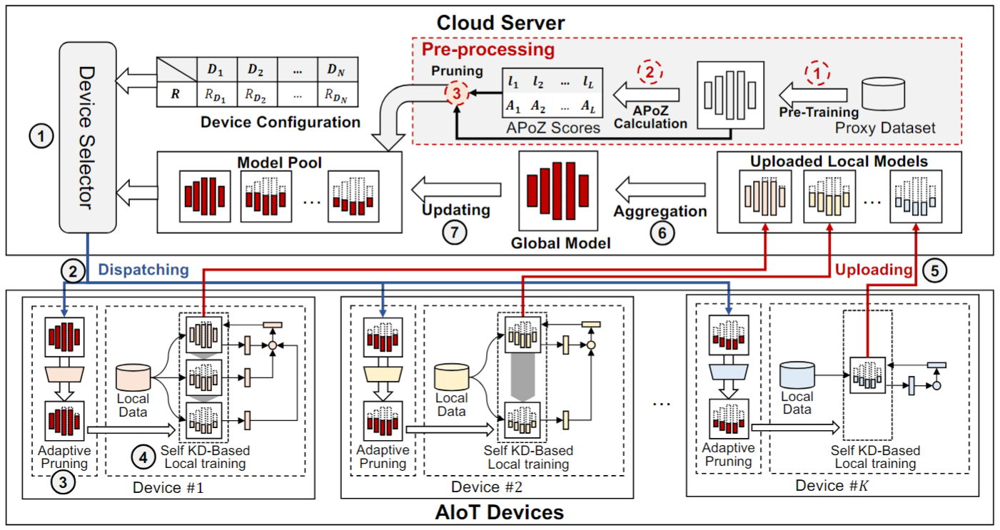
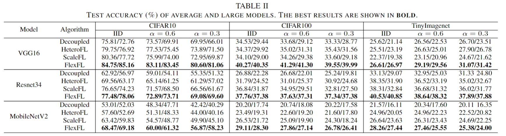
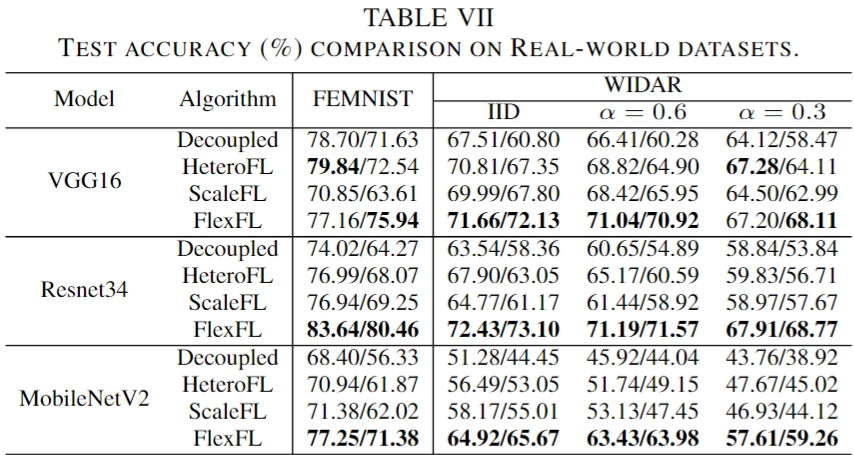
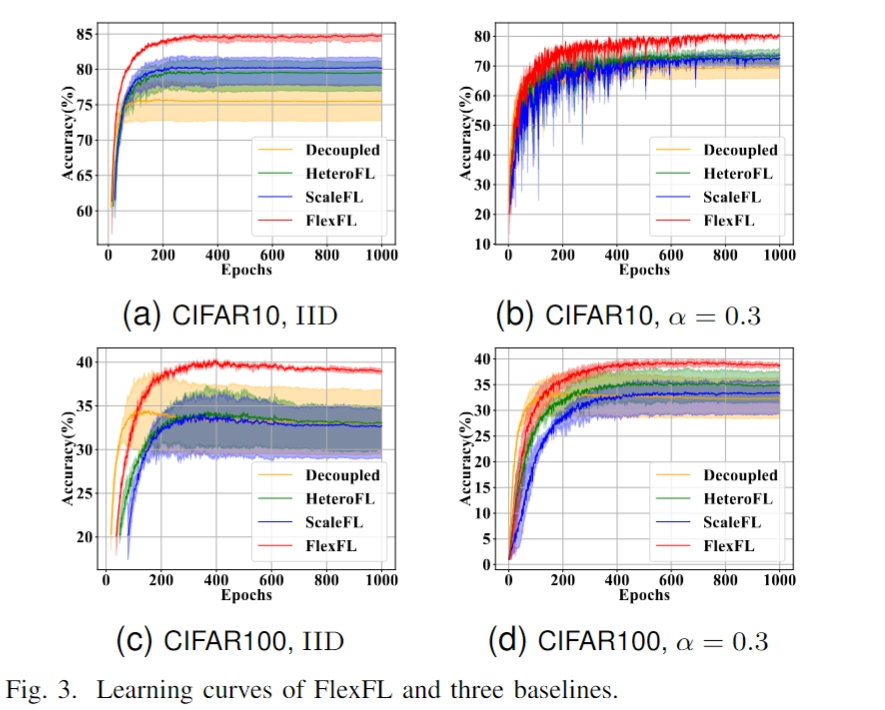

# FlexFL: Heterogeneous Federated Learning via APoZ-Guided Flexible Pruning in Uncertain Scenarios

Code for the following paper:

Z. Chen, C. Jia, M. Hu, X. Xie, A. Li, and M. Chen, ‘[FlexFL: Heterogeneous Federated Learning via APoZ-Guided Flexible Pruning in Uncertain Scenarios](https://arxiv.org/abs/2407.12729)’, arXiv preprint arXiv:2407. 12729, 2024.

Note: The scripts will be slow without the implementation of parallel computing. 

## Introduction

Along with the increasing popularity of Deep Learning (DL) techniques, more and more Artificial Intelligence of Things (AIoT) systems are adopting federated learning (FL) to enable privacy-aware collaborative learning among AIoT devices. However, due to the inherent data and device heterogeneity issues, existing FL-based AIoT systems suffer from the model selection problem. Although various heterogeneous FL methods have been investigated to enable collaborative training among heterogeneous models, there is still a lack of i) wise heterogeneous model generation methods for devices, ii) consideration of uncertain factors, and iii) performance guarantee for large models, thus strongly limiting the overall FL performance. To address the above issues, this paper introduces a novel heterogeneous FL framework named FlexFL. By adopting our Average Percentage of Zeros (APoZ)-guided flexible pruning strategy, FlexFL can effectively derive best-fit models for heterogeneous devices to explore their greatest potential. Meanwhile, our proposed adaptive local pruning strategy allows AIoT devices to prune their received models according to their varying resources within uncertain scenarios. Moreover, based on self-knowledge distillation, FlexFL can enhance the inference performance of large models by learning knowledge from small models. Comprehensive experimental results show that, compared to state-of-the-art heterogeneous FL methods, FlexFL can significantly improve the overall inference accuracy by up to 14.24%.

## Requirements

python>=3.6  
pytorch>=0.4

## Run

FlexFL:

If you want to use the APoZ scores from preprocessing stage:

> python main_fed.py --gpu 0 --algorithm FlexFL --model vgg --dataset cifar10 --num_channels 3 --num_classes 10 --iid 1 --client_hetero_ration 4:3:3 --client_chosen_mode available --pretrain 200 --gamma 10 --only 1

> python main_fed.py --gpu 0 --algorithm FlexFL --model vgg --dataset cifar10 --num_channels 3 --num_classes 10 --iid 0 --client_hetero_ration 4:3:3 --client_chosen_mode available --pretrain 200 --gamma 10 --only 1 --noniid_case 5 --data_beta 0.6

Otherwise you can use the APoZ scores we use in experiment:

>python main_fed.py --gpu 0 --algorithm FlexFL --model vgg --dataset cifar10 --num_channels 3 --num_classes 10 --iid 1 --client_hetero_ration 4:3:3 --client_chosen_mode available --pretrain 0 --apoz 9 --gamma 10 --only 1

>python main_fed.py --gpu 0 --algorithm FlexFL --model vgg --dataset cifar10 --num_channels 3 --num_classes 10 --iid 0 --client_hetero_ration 4:3:3 --client_chosen_mode available --pretrain 0 --apoz 9 --gamma 10 --only 1 --noniid_case 5 --data_beta 0.6

For more APoZ scores, see `Algorithm/Training_FlexFL.py`. For more argument settings, see `utils/options.py` .

HeteroFL:

> python main_fed.py --gpu 0 --algorithm HeteroFL --model vgg --dataset cifar10 --num_channels 3 --num_classes 10 --iid 1 --client_hetero_ration 4:3:3 --client_chosen_mode available

> python main_fed.py --gpu 0 --algorithm HeteroFL --model vgg --dataset cifar10 --num_channels 3 --num_classes 10 --iid 0 --noniid_case 5 --data_beta 0.6 --client_hetero_ration 4:3:3 --client_chosen_mode available

Decoupled:
> python main_fed.py --gpu 0 --algorithm Decoupled --model vgg --dataset cifar10 --num_channels 3 --num_classes 10 --iid 1 --client_hetero_ration 4:3:3 --client_chosen_mode available

> python main_fed.py --gpu 0 --algorithm Decoupled --model vgg --dataset cifar10 --num_channels 3 --num_classes 10 --iid 0 --noniid_case 5 --data_beta 0.6 --client_hetero_ration 4:3:3 --client_chosen_mode available

ScaleFL:

>python main_fed.py --gpu 0 --algorithm ScaleFL --model vgg --dataset cifar10 --num_channels 3 --num_classes 10 --iid 1 --width_ration 0.75 0.82 1.0 --client_hetero_ration 4:3:3 --gamma 0.05 

> python main_fed.py --gpu 0 --algorithm ScaleFL --model vgg --dataset cifar10 --num_channels 3 --num_classes 10 --iid 0 --noniid_case 5 --data_beta 0.6 --width_ration 0.75 0.82 1.0 --client_hetero_ration 4:3:3 --gamma 0.05

## Results

## Ackonwledgements

Acknowledgements give to [youkaichao](https://github.com/youkaichao).

## References
McMahan, Brendan, Eider Moore, Daniel Ramage, Seth Hampson, and Blaise Aguera y Arcas. Communication-Efficient Learning of Deep Networks from Decentralized Data. In Artificial Intelligence and Statistics (AISTATS), 2017.

Li, Tian, et al. "Federated optimization in heterogeneous networks." Proceedings of Machine Learning and Systems 2 (2020): 429-450.

Li, Qinbin, Bingsheng He, and Dawn Song. "Model-contrastive federated learning." Proceedings of the IEEE/CVF Conference on Computer Vision and Pattern Recognition. 2021.

Fraboni, Yann, et al. "Clustered sampling: Low-variance and improved representativity for clients selection in federated learning." International Conference on Machine Learning. PMLR, 2021.

Yao, Dezhong, et al. "Local-Global Knowledge Distillation in Heterogeneous Federated Learning with Non-IID Data." arXiv preprint arXiv:2107.00051 (2021).

Zhu, Zhuangdi, Junyuan Hong, and Jiayu Zhou. "Data-free knowledge distillation for heterogeneous federated learning." International Conference on Machine Learning. PMLR, 2021.

Gao, Liang, et al. "FedDC: Federated Learning with Non-IID Data via Local Drift Decoupling and Correction." Proceedings of the IEEE/CVF Conference on Computer Vision and Pattern Recognition. 2022.

Kim, Jinkyu and Kim, Geeho and Han, Bohyung. "Multi-Level Branched Regularization for Federated Learning." International Conference on Machine Learning. PMLR, 2022.

Lee, Gihun, et al. "Preservation of the global knowledge by not-true distillation in federated learning." Advances in Neural Information Processing Systems 35 (2022): 38461-38474.
